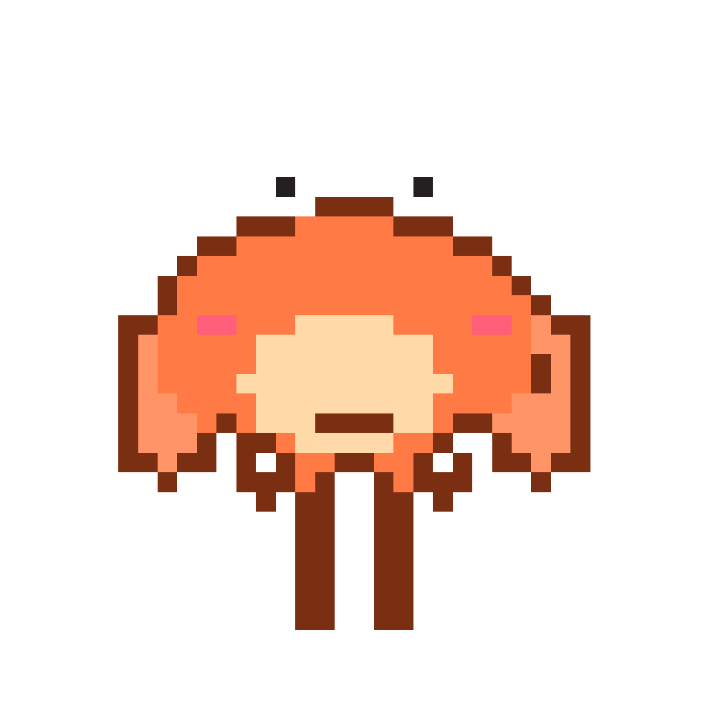

# DeskyBuddy

Ein winziges Chibi-Haustier, das auf deiner Taskbar (Windows) bzw. am unteren Bildschirmrand (macOS Dock-Bereich, Linux Panel) sitzt, herumläuft, auf dich reagiert und sich streicheln/füttern/werfen lässt. Vier Charaktere zur Auswahl: Krabbe 🦀, Avocado 🥑, Zitrusscheibe 🍋, Biene 🐝.



## Installation

Fertige Installer werden per GitHub Actions gebaut, sobald ein `v*`-Tag gepusht oder der Workflow manuell ausgelöst wird — siehe **Actions → Build installers** in diesem Repo, dort als Artefakte herunterladbar.

| Plattform | Datei | Hinweis |
|---|---|---|
| Windows | `DeskyBuddy-Setup-<version>.exe` | One-Click-Installer, kein Admin nötig, landet im Start-Menü + Autostart-Option |
| macOS | `DeskyBuddy-<version>.dmg` / `.zip` | Unsigniert — Gatekeeper wird beim ersten Start warnen, siehe unten |
| Linux | `DeskyBuddy-<version>.AppImage` / `.deb` | AppImage braucht keine Installation, `.deb` für Debian/Ubuntu |

### macOS: Gatekeeper-Warnung umgehen

Da die App (noch) nicht mit einem Apple-Developer-Zertifikat signiert/notarisiert ist, blockiert macOS den ersten Start. Rechtsklick auf `DeskyBuddy.app` → **Öffnen** → im Dialog nochmal **Öffnen** bestätigen. Danach startet sie normal per Doppelklick.

### Linux: AppImage ausführbar machen

```bash
chmod +x DeskyBuddy-*.AppImage
./DeskyBuddy-*.AppImage
```

## Features

- Läuft auf der Taskbar/dem Panel herum, pausiert zwischendurch, dreht sich zur Maus um
- Reagiert auf Tippen (setzt sich hin), laufende Musik (Kopfhörer), Abwesenheit (Zzz), Vollbild-Apps (versteckt sich)
- Streicheln, Füttern, Ziehen, Werfen (mit Physik) per Maus
- Zufällige Idle-Animationen (lesen, gähnen, würfeln, ...)
- Tag-/Nacht-Palette je nach Uhrzeit
- Folgt dem aktiven Monitor bei Mehrfachbildschirm-Setups
- Alle Erkennungs-Features sind pro Toggle in den Einstellungen (Tray-Icon → Rechtsklick) abschaltbar, inkl. Energiesparmodus, der alles temporär pausiert

Windows hat aktuell den vollsten Funktionsumfang (u. a. Musik-Erkennung über die Windows SMTC-API via PowerShell) — dieses eine Feature ist auf macOS/Linux nicht verfügbar, alles andere läuft plattformübergreifend.

## Entwicklung

Voraussetzung: Node.js + npm.

```bash
npm install
npm start                      # App direkt starten (electron .)
BUDDY_FORCE_NIGHT=1 npm start  # Nacht-Palette erzwingen, ohne auf echte Uhrzeit zu warten
```

Kein Build-Schritt, kein Bundler — die Renderer-Dateien werden per `<script>`-Tags direkt geladen (siehe `CLAUDE.md` für Architekturdetails).

### Installer selbst bauen

```bash
npm run dist:win     # NSIS-Installer, nur von Windows aus
npm run dist:mac     # dmg + zip, nur von macOS aus
npm run dist:linux   # AppImage + deb, nur von Linux aus
```

Native Module (`uiohook-napi`, `active-win`) und die Linux-Packaging-Tools (`mksquashfs`, `dpkg-deb`) lassen sich nicht plattformübergreifend cross-kompilieren — jeder Installer muss auf seinem Ziel-Betriebssystem gebaut werden. Der Workflow in `.github/workflows/build.yml` übernimmt das automatisch über eine Runner-Matrix.

## Lizenz

Privates Projekt, kein Open-Source-Lizenztext hinterlegt.
